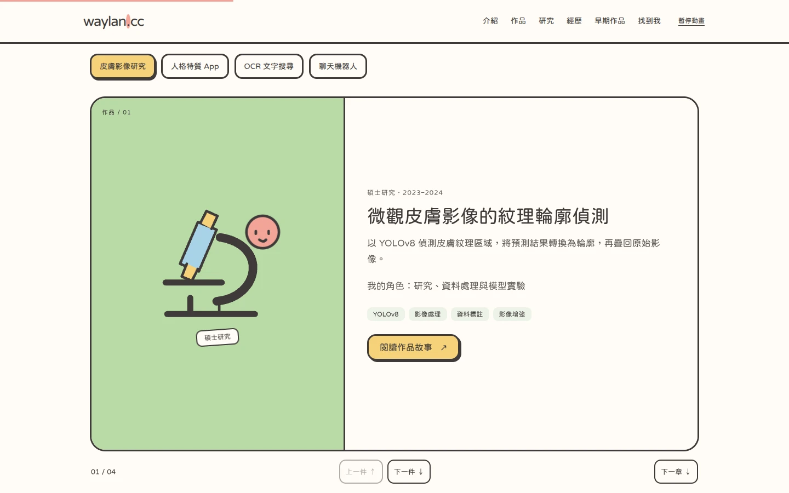
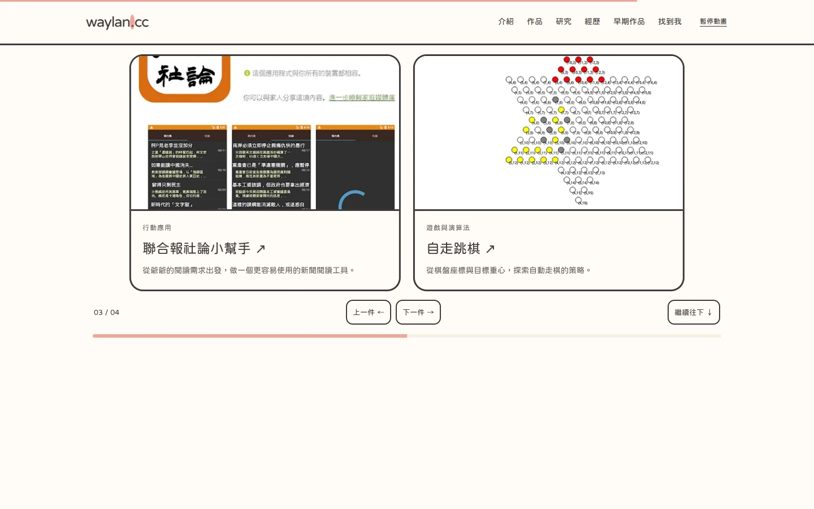
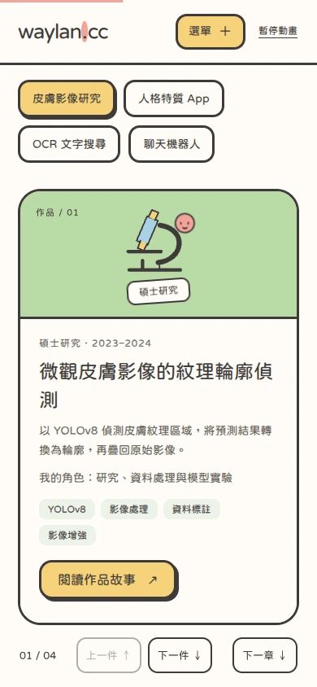
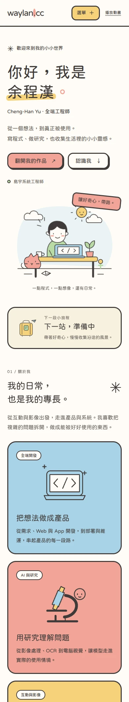

# 日系繪本風個人網站

網站以余程漢既有的履歷、研究與作品內容，重新整理成「工程師的繪本小旅程」。首頁依序為自介與 SVG 插圖、出發倒數、重點卡片與成長脈絡、可切換的精選作品、研究與發表、工作經歷、早期作品、學歷與聯絡入口。

## 視覺

- 和紙白 `#FFFCF6`、墨灰 `#3E3A39`，主要框線 3px。
- 珊瑚粉 `#F2A497`、山吹黃 `#F6D27A`、水色 `#A8D3E6`、若竹綠 `#B9DAA5`。
- 淺色背景、大圓角、平塗與實色位移陰影；不使用漸層。
- Google Fonts Huninn 由固定版本 `@fontsource/huninn` 隨網站提供，無需向 Google 發送字型請求；載入失敗時使用系統繁體中文字型。
- 插圖由 `src/components/StoryIllustration.astro` 以原生 SVG 繪製，題材包含工程師書桌、筆電、顯微鏡、手機、相機、書本、信封與行李箱。
- 前台共用主題為 `src/styles/storybook.css`；作品詳頁、作品索引與隱私頁也沿用此主題。後台仍使用原有樣式。

## 捲動互動

| 效果              | 使用位置與行為                                                                               |
| ----------------- | -------------------------------------------------------------------------------------------- |
| Scroll-triggered  | 重點卡片、經歷與早期作品進入視窗後浮出；同排卡片間隔 130ms，手機逐張進場。                   |
| Scroll-linked     | 首頁貼紙與章節符號隨捲動旋轉；位移直接對應捲動位置，停止捲動即停止。                         |
| Parallax          | 首頁 SVG 拆為天空與書桌前景，天空移動速度較慢，形成景深。                                    |
| Sticky            | 頂端選單、作品標籤及橫向展覽黏附在頂端；手機選單保留 Escape 關閉與焦點返回。                 |
| Scroll Snap       | 精選作品使用原生 `scroll-snap-type: y mandatory`，一次翻一件作品；支援標籤、上下按鈕及鍵盤。 |
| Horizontal Scroll | 早期作品黏住時，向下捲動直接帶動作品橫向位移；支援方向鍵、上一件／下一件與下一章入口。       |

- 全程保留原生捲動，沒有攔截 wheel / touch 或強制鎖住頁面。
- 當螢幕高度不足 760px，精選作品使用原有的標籤切換；橫向展覽高度不足以完整顯示時，改為可原生橫滑與吸附的作品列。
- 「暫停動畫」或系統減少動態效果會關閉視差、捲動連動、整頁吸附與黏附橫向展覽，恢復可完整閱讀的卡片與標籤切換。
- 背景分頁暫停；使用被動 scroll 事件與單次 requestAnimationFrame 更新，沒有持續追趕捲動位置的動畫迴圈。
- 未執行 JavaScript 時，精選作品與早期作品全部顯示，研究圖與連結仍可閱讀。
- 既有研究階段切換、圖片放大、統計與公開內容篩選仍保留。
- 捲動程式在 `src/scripts/scroll-motion.ts`，樣式在 `src/styles/scroll-motion.css`；精選作品吸附在 `src/scripts/storybook.ts`。

## 出發倒數

在 `src/data/departure.ts` 設定：

```ts
export const departure: { title: string; at: string | null } = {
  title: '下一站，準備中',
  at: null,
};
```

確認行程後，將 `title` 改成實際目的地或旅程名稱，並以帶明確時區的 ISO 8601 格式設定 `at`（`YYYY-MM-DDTHH:mm:ss+08:00`）。目前使用者尚未提供日期，因此保持 `null`，顯示準備中的狀態，避免捏造行程。

有效日期會顯示臺北時間及天／時／分／秒；到期後顯示「已經出發，旅程開始！」，不出現負數。背景分頁停止計時，返回時重新計算。秒數不使用 live region，避免螢幕閱讀器每秒播報。

## 本機驗證

```sh
npm run build
node --import tsx --test tests/*.test.ts
```

第二條與 `npm test` 使用相同測試，但避開受限環境中 tsx CLI 的 Unix IPC pipe。正式專案仍可正常使用 `npm test`。

## 預覽與驗證紀錄

- `npm run build`：49 個 Astro 檔案，0 errors / warnings / hints，Vercel 建置完成。
- `node --import tsx --test tests/*.test.ts`：10 項測試通過，涵蓋倒數、內容可見性與既有安全／資料庫檢查。
- Chromium：檢查首頁 320、375、390、600、768、960、1440px，並檢查作品索引、研究／App／作品詳頁與隱私頁的手機、桌面版；均無水平溢出。
- 檢查分頁鍵盤操作、手機選單與 Escape 焦點返回、研究圖片放大、動畫暫停、減少動態效果、未設定倒數與停用 JavaScript 時的內容可讀性。

新增捲動互動的 46 項 Chromium 檢查全部通過，包含原生滑鼠滾輪吸附、模擬手機手勢、停止捲動時的位移穩定性、視差速度、分批進場、橫向黏附展覽、兩排標籤下的作品視窗、短螢幕替代操作與靜態降級；沒有 JavaScript 錯誤。

捲動互動預覽：







桌面與手機預覽（首頁上半部）：



